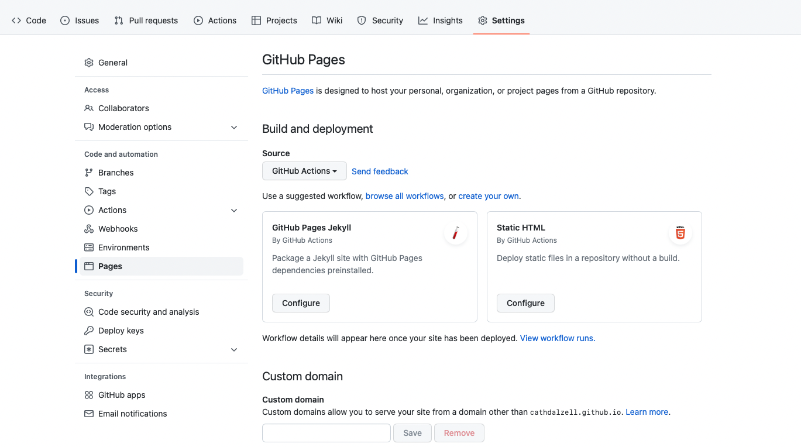
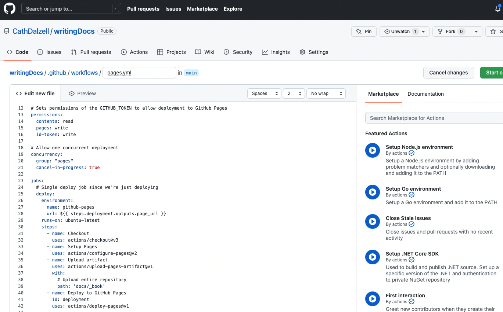
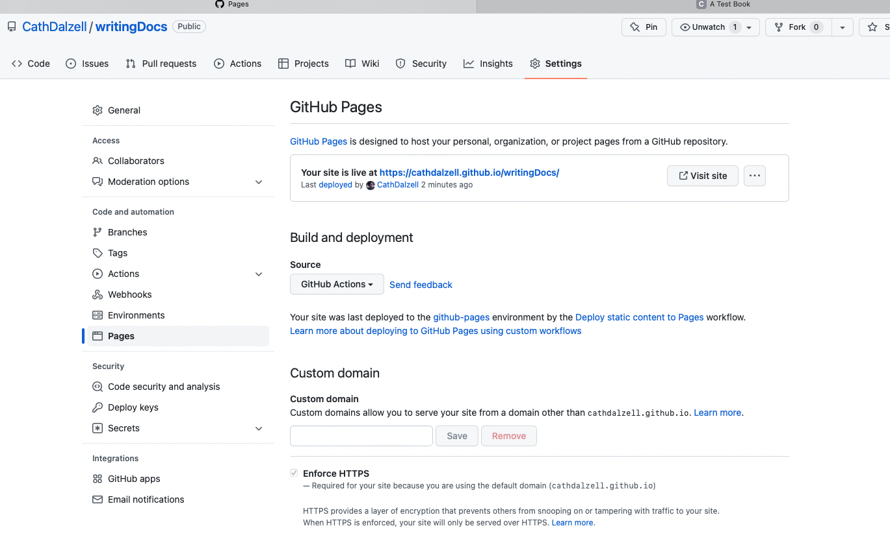

```{r setup, include=FALSE}
knitr::opts_chunk$set(echo = TRUE, comment = NA)
library('bookdown')
```

# R Markdown

When you create an RMarkdown document in RStudio, it helpfully supplies an example scripts to remind you of the most common commands.

## Results of the sample script.

This is an R Markdown document. Markdown is a simple formatting syntax for authoring HTML, PDF, and MS Word documents. For more details on using R Markdown see <http://rmarkdown.rstudio.com>.

When you click the **Knit** button a document will be generated that includes both content as well as the output of any embedded R code chunks within the document. You can embed an R code chunk like this:

```{r cars}
summary(cars)
```

## Including Plots

You can also embed plots, for example:

```{r pressure, echo=FALSE}
plot(pressure)
```

Note that the `echo = FALSE` parameter was added to the code chunk to prevent printing of the R code that generated the plot.


# Using bookdown

R package `bookdown` allows organizing and compiling several Rmarkdown (or simple markdown files) into a book like website complete with table of contents and chapter links. The author, Yihui Xie, illustrates the results in bookdown formatted [documentation](https://bookdown.org/yihui/bookdown/). `Bookdown` has a lot of options, but I'm just going to focus on the basics required to host a multipage document on github as supplementary documentation for a repo. 

## Pre-requisites

You have to be able to install R and RStudio. Know enough about R to install a package and know enough about RStudio to know how to create an RMarkdown document.

## The Instructions

1. Install R and RStudio
2. In the console of RStudio, enter `install.packages("bookdown")` to install the package.
3. Create your repo, say `myRepo` and create and R Project based on that repo.
4. Create a folder in `myRepo` called `docs`, say. Your book will live in `docs`.
5. Create and Rmd file called `index.Rmd` in `docs`.

An RMarkdown document begins with some yaml lines. The default that comes with RStudio looks like this:

```
title: "My Title"
author: "Catherine Dalzell"
date: "2022-09-06"
output: html_document
```

This yaml instructs `knitr` to render the document in the usual way. We need to change this if we want to get `bookdown` output. Here is a simple example:

```
title: "A Test Book"
author: "Catherine Dalzell"
date: "`r Sys.Date()`"
site: bookdown::bookdown_site
output: bookdown::gitbook
documentclass: book
link-citations: yes
github-repo: CathDalzell/writingDocs
description: "A simple Bookdown demo"
```

There are other options, but this will get the job done. Note that this yaml is specific to hosting in github format on Github. I have supplied the name of my repo -- writingDocs in this case and indicated that I want the output to be `bookdown::gitbook`. 

### Document structure

Major headings in markdown are noted with a single hash `#`. In bookdown, a major heading signifies the start of a new chapter. double hashes indicate subsectionsm, which also get links in the table of contents. Triple hashes do not show up in the TOC, but they display in the body of the document as minor headings. 

It is possible to build a bookdown book from a collection of Rmd files, but the simplest way to get a book is to write everything in one long Rmd file, using major headings to define the chapters.

### knit and publish

6. click the `Knit` button in RStudio to render the book. It should display in RStudio's default browser. 
7. When you like what you see, push the entire project to Github. 
8. Check your repo. The files that contain your book will be there, but they will not display as a static web site.
9. Open the `settings` off your repo and click on `pages`. It's on the left hand side of the page.


10. Under `source`, select `GitHub Actions` followed by `Static HTML`.
11. You will be taken to a configuration document.


12. The only thing you need to change is the `path` entry. The default is `.`. Change this to the folder that contains your bookdown output. In my case, this is `docs/_book`.
13. Press the big green button to commit your change and pull it back down to your local repo.
14. Wait a moment and then check under settings -> pages again. You should see something like this:


15. GitHub informs you that your site is live at `[book_url]`.
16. To make your book easy to find, copy the url and link to it from your `Readme`. 

# Another chapter

## A section

Lorem ipsum dolor sit amet, consectetur adipiscing elit, sed do eiusmod tempor incididunt ut labore et dolore magna aliqua. At risus viverra adipiscing at in tellus integer feugiat scelerisque. In aliquam sem fringilla ut morbi tincidunt augue interdum velit. Integer eget aliquet nibh praesent tristique. Commodo odio aenean sed adipiscing diam donec adipiscing. Euismod lacinia at quis risus sed vulputate. Arcu non sodales neque sodales ut etiam sit amet. Montes nascetur ridiculus mus mauris vitae. Vitae ultricies leo integer malesuada nunc vel. Turpis egestas maecenas pharetra convallis posuere morbi.

### A sub section

Rhoncus urna neque viverra justo nec ultrices dui sapien. Adipiscing at in tellus integer feugiat scelerisque varius. Eget egestas purus viverra accumsan. Vitae tortor condimentum lacinia quis vel eros. Nisl nisi scelerisque eu ultrices vitae. Quam adipiscing vitae proin sagittis nisl rhoncus mattis rhoncus urna. Mauris ultrices eros in cursus turpis massa. Duis at consectetur lorem donec massa sapien. Sagittis orci a scelerisque purus. Donec massa sapien faucibus et. Quis lectus nulla at volutpat diam ut venenatis tellus. Arcu cursus vitae congue mauris rhoncus aenean vel elit. Magna fringilla urna porttitor rhoncus dolor. Velit sed ullamcorper morbi tincidunt ornare. Ipsum faucibus vitae aliquet nec ullamcorper. Ipsum dolor sit amet consectetur adipiscing. Sit amet luctus venenatis lectus magna fringilla. Egestas diam in arcu cursus euismod quis viverra.

## Another section

Interdum consectetur libero id faucibus nisl. Molestie a iaculis at erat pellentesque. Pulvinar elementum integer enim neque volutpat ac. Consectetur libero id faucibus nisl tincidunt. Eu scelerisque felis imperdiet proin fermentum leo. Tempus egestas sed sed risus pretium quam vulputate dignissim. Sem integer vitae justo eget magna fermentum iaculis. In dictum non consectetur a erat nam at lectus urna. Tellus in hac habitasse platea dictumst vestibulum. Proin sed libero enim sed. Fermentum odio eu feugiat pretium nibh ipsum. Suspendisse faucibus interdum posuere lorem. Magna fermentum iaculis eu non diam phasellus vestibulum lorem sed. Porta non pulvinar neque laoreet suspendisse. Faucibus a pellentesque sit amet porttitor eget dolor morbi. Pretium aenean pharetra magna ac placerat vestibulum lectus. Ultricies lacus sed turpis tincidunt.

Odio pellentesque diam volutpat commodo sed egestas egestas. Velit scelerisque in dictum non consectetur a erat. Diam donec adipiscing tristique risus. Suspendisse ultrices gravida dictum fusce ut placerat orci. Mauris ultrices eros in cursus turpis massa tincidunt. Vivamus at augue eget arcu dictum varius. Neque sodales ut etiam sit amet. Quisque egestas diam in arcu. Lorem sed risus ultricies tristique nulla aliquet enim tortor. Mauris augue neque gravida in fermentum et sollicitudin. Arcu non odio euismod lacinia at. Ultrices dui sapien eget mi proin sed libero enim sed. Enim nunc faucibus a pellentesque sit amet porttitor eget dolor. Eleifend quam adipiscing vitae proin. Id donec ultrices tincidunt arcu non.

Cras ornare arcu dui vivamus arcu felis bibendum ut. Consectetur adipiscing elit pellentesque habitant morbi tristique. Et malesuada fames ac turpis egestas integer eget aliquet. Convallis aenean et tortor at risus viverra adipiscing. Laoreet id donec ultrices tincidunt arcu non sodales neque. Condimentum id venenatis a condimentum vitae sapien pellentesque. Integer eget aliquet nibh praesent tristique magna sit amet. Hendrerit gravida rutrum quisque non tellus orci. Consectetur libero id faucibus nisl tincidunt. Sed risus ultricies tristique nulla aliquet enim tortor at. At tellus at urna condimentum mattis pellentesque. Quam adipiscing vitae proin sagittis nisl. Risus nullam eget felis eget nunc lobortis mattis. Urna neque viverra justo nec ultrices dui sapien eget mi. Nisl purus in mollis nunc sed id semper. Semper feugiat nibh sed pulvinar. Sapien et ligula ullamcorper malesuada proin libero nunc. Cras semper auctor neque vitae tempus quam. Scelerisque eleifend donec pretium vulputate sapien nec sagittis.


<!--chapter:end:index.Rmd-->

